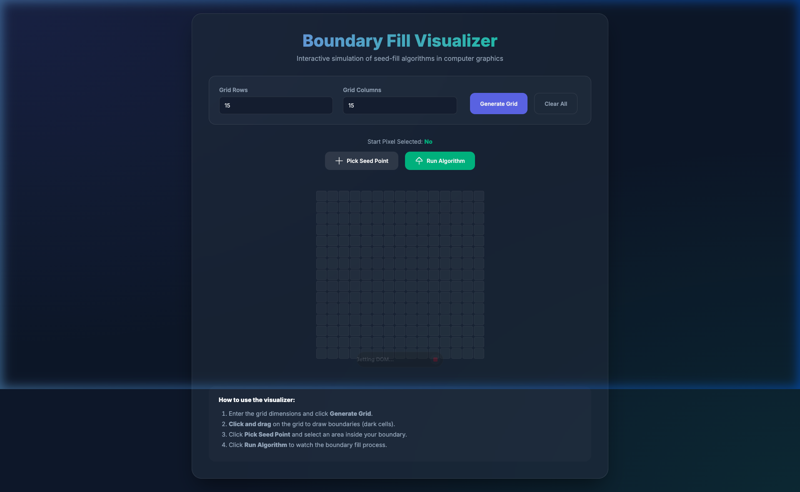

# Boundary Fill Algorithm Visualizer: Interactive Computer Graphics Simulation

An advanced, interactive web-based visualizer for the **Boundary Fill Algorithm**. This project provides a real-time simulation of how seed-fill algorithms work in a pixel-based grid, commonly used in computer graphics and digital image processing.



## Technical Overview

The **Boundary Fill Algorithm** is a fundamental recursive procedure used in computer graphics to fill a connected region of a specific color, bounded by a different color. It is categorized as a "seed-fill" algorithm, where the process initiates from a starting coordinate $(x, y)$ known as the **seed point**.

### Recursive Logic and Adjacency
In this implementation, we utilize a **4-connected adjacency** model. This means that for any given pixel $(x, y)$, the algorithm recursively examines its four immediate orthogonal neighbors:
- Right: $(x+1, y)$
- Left: $(x-1, y)$
- Up: $(x, y+1)$
- Down: $(x, y-1)$

### Mathematical Representation
The algorithm can be defined as a function $F(x, y)$ that executes until a boundary condition is met:

$$
F(x, y) = 
\begin{cases} 
\text{fill}(x, y) & \text{if } \text{color}(x, y) \neq \text{boundary\_color} \text{ and } \text{color}(x, y) \neq \text{fill\_color} \\
\text{stop} & \text{otherwise}
\end{cases}
$$

### Algorithm Pseudo-code
```cpp
void boundaryFill(int x, int y, int fill_color, int boundary_color) {
    // Retrieve the color of the current pixel
    int current_color = getPixelColor(x, y);

    // Termination condition: pixel is boundary or already filled
    if (current_color != boundary_color && current_color != fill_color) {
        // Color the current pixel
        setPixelColor(x, y, fill_color);

        // Recurse to 4-connected neighbors
        boundaryFill(x + 1, y, fill_color, boundary_color);
        boundaryFill(x - 1, y, fill_color, boundary_color);
        boundaryFill(x, y + 1, fill_color, boundary_color);
        boundaryFill(x, y - 1, fill_color, boundary_color);
    }
}
```

## Visualization of the Process

The following animation demonstrates the recursive nature of the algorithm as it traverses a bounded region:


## Key Features of this Visualizer
- **Dynamic Grid Generation**: Configure custom $M \times N$ pixel matrices.
- **Manual Boundary Definition**: Interactive "draw" mode to create arbitrary shapes.
- **Async Execution**: Real-time animation of the recursion stack using `async/await` and time delays.
- **State Persistence**: Visual indicators for start pixels, boundaries, and processed regions.

## Installation and Usage

### Prerequisites
A modern web browser with JavaScript enabled.

### Getting Started
1. Clone this repository:
   ```bash
   git clone https://github.com/adhishagc/boundaryfill-algorithm-simulation-sample-code.git
   ```
2. Open `index.html` in your browser.

### User Instructions
1. **Define Grid**: Input dimensions and click **Generate Grid**.
2. **Draw Boundaries**: Click and drag on the grid to define the shape boundaries.
3. **Select Seed**: Enable **Pick Seed Point** and click inside the bounded area.
4. **Execute**: Click **Run Algorithm** to visualize the recursive fill.

## About the Subject Matter
Seed filling algorithms are computationally expensive for large regions due to the depth of the recursion stack. Modern implementations often optimize this using scanline-fill techniques or iterative stack-based approaches to prevent stack overflow errors in high-resolution buffers.

---
*Optimized for Computer Science Education and SEO Visibility.*
